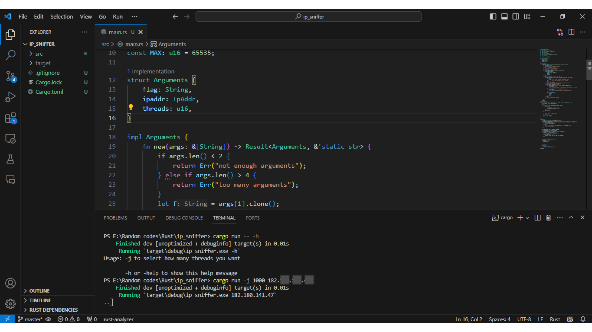

# Rust IP Port Sniffer

This is a simple port sniffer based on Rust.



## How to Run

To run the program, follow these simple steps:

1. **Install Rust:**
   If you haven't installed the Rust development environment yet, you can do so by following the instructions [here](https://www.rust-lang.org/tools/install).

2. **Run Help:**
   After installing Rust, navigate to the project directory in your terminal and run the following command to display help:

   ```bash
   cargo run -- -h

3. **Run the Sniffer:**
   Open your terminal and navigate to the project directory. Run the following command, replacing <number of threads> with the desired number of threads and <your IP address> with your actual IP address:

   ```bash
   cargo run -- -j <number of threads> <your IP address>

This command will start the sniffer for you. Enjoy!

## Rust Libraries Used

- std::env
- std::io::{self, Write}
- std::net::{IpAddr, TcpStream}
- std::process
- std::str::FromStr
- std::sync::mpsc::{channel, Sender}
- std::thread

## License

Copyright (c) 2024 arslanstack.

his project is licensed under the [MIT License](LICENSE.md). Feel free to contribute and enhance the project!